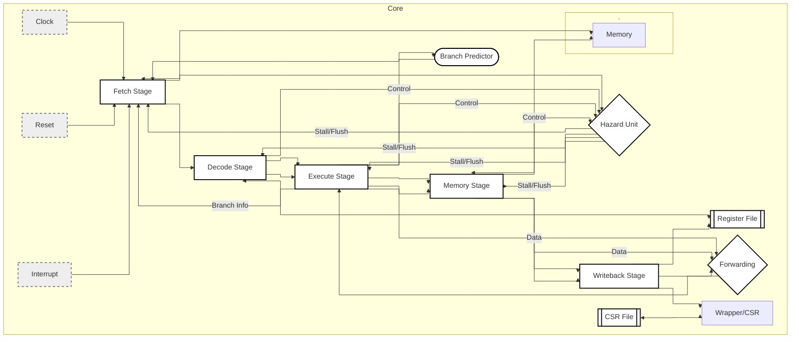

# VenomCPU

## Introduction
VenomCPU is a RISC-V CPU core implementing the RV32I base ISA with Zicsr support, verified using the RISC-V Compatibility Framework (RISCOF). The core is provided as synthesizable SystemVerilog, and can be used in FPGA, as a reference implementation, a research and learning platform, or as a foundation for custom RISC-V system designs.

## Features

- RISC-V RV32I Zicsr ISA
- In-Order 5-Stage Pipeline
- 76 Test RISCOF Verication Suite 
- Decoupled Memory For External RAM
- Hardwired M-Mode Execution

## Simulator
This SystemVerilog core comes with a corresponding simulator to more easily observe and test behavior. The simulation tool used is Verilator, which compiles HDL to native binaries. Verilator takes two input catagories, HDL and a C++ test harness. The simulator included here is already compiled with a fixed test harness. To run the simulator with the default test harness, execute the command below from the repository root:
```bash
# Executes the simulator
./Verilator/VTop
```

For non-trivial debugging, a custom test harness may be necessary. To create a custom test harness and rebuild the simulator, you must have the Verilator CLI tool installed. From there, create a new file in the repository root named sim_main.cpp. Refer to the Verilator documentation for guidance on writing a custom C++ test harness tailored to your specific needs. Once the file is complete, run the following commands:
```bash
# Version
Verilator 5.020 2024-01-01 rev (Debian 5.020-1)

# Produces a C program that simulates HDL
verilator -Wall -Wno-fatal --cc \
  Core/StaticPack.sv Core/ConfigPack.sv Core/Top.sv Core/Control/*.sv \
  Core/Pipeline/*.sv Core/Interface/*.sv \
  --top-module Top --exe sim_main.cpp \
  --Mdir Verilator

# Compiles the C program to an executable
export PATH=/usr/bin:/bin:$PATH
hash -r
make -C Verilator -f VTop.mk -j"$(nproc)"

# Executes the simulation
./Verilator/VTop
```
Any changes to the HDL require a full rebuild of both the C program and the executable. For edits to the test harness alone, only rebuilding the executable is necessary. Print statements may also exist in the outsude of the test harness, and could hinder directed testing. Ensure all $display and $strobe commands inside the HDL are removed if a blank slate simulation is required. 

## Supported CSR Reference Table
| CSR       | ACCESS | NOTES                                 |
|-----------|--------|---------------------------------------|
| MSTATUS   | MRW    | Only MRW Bits 3 + 7. M-Mode Hardwired |
| MEPC      | MRW    | Word Align Mask                       |
| MCAUSE    | MRW    | Includes Misalignment Traps           |
| MTVAL     | MRW    | Standard                              |
| MIE       | MRW    | Only MRW Bits 3 + 7 + 11              |
| MTVEC     | MRW    | Word Align Mask + Direct Mode Only    |
| MSCRATCH  | MRW    | Standard                              |
| MISA      | MRO    | RV32I                                 |
| MVENDORID | MRO    | Standard                              |
| MARCHID   | MRO    | Stadard                               |
| MIP       | MRW    | Writes Ignored But Don't Trap         |
| MCYCLE    | MRW    | Writes Override Hardware Incriments   |
| MINSTRET  | MRW    | Writes Override Hardware Incriments   |

## Dataflow Chart



